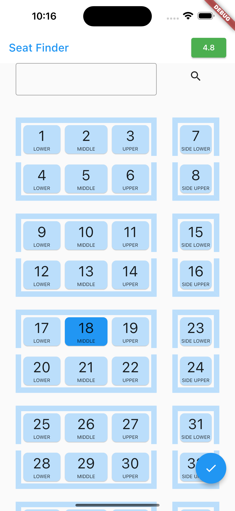

<p>
    
    
    
    
</p>

# Train Seat Booking System using Flutter

    This widget is a system for booking train seats.

## Installation

Clone Repository
```
git clone https://github.com/anoying-kid/Train-Seat-Booking-System.git
```

Get required libraries
```
flutter pub get
```

## Working

